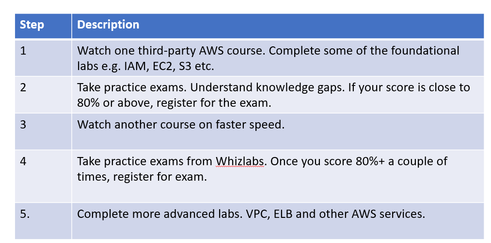

## How to prepare for AWS certifications?

In this article, we will describe how to prepare for AWS Solutions Architect certification and AWS Cloud Practitioner exams. Our goal is to help you prepare in the quickest possible time, pass the certification, and maximize the knowledge gained. I will lay out different preparation paths depending on your background. At a high-level here is an overview of how to prepare for AWS certifications.

1. Watch one third-party course video. Focus on understanding the concepts and make notes. For labs, start with core/foundational AWS services labs (create users, EC2, S3 buckets etc.)
2. Take one of the easier practice exams (e.g. Udemy) and make a list of the areas you are strong in and the areas for improvement. 
3. Watch a second video course (skip chapters which you already comfortable with)
4. Do a few more labs in the weakest areas.
5. Take more practice exams including those from Whizlabs. Once your score reaches 80%+ consistently, you are ready for the actual exam. **Schedule your exam date right away and commit to it**. In each of the practice exams, pay particular attention to the questions you did not get right. Revise those concepts.
6. 

## Do you need an IT background for AWS certifications?

For AWS Cloud Practitioner certification, you do not need an IT background. It will help to understand how compute, storage, and network form the foundation of the computing on the web. It is a foundational certification for people without any prior technical experience. Irrespective of your prior experience, Certified Cloud Practitioner (CCP) is a great certification if you are just beginning with your certification journey. Even if you aspire to do Certified Solutions Architect (CSA), we highly recommend, that you start with the CCP certification. Here is why:

- Certified Cloud Practitioner is one of the easiest exam in the AWS certification suite. Passing this exam boosts the confidence and the lays the foundation for future certifications. 
- You will be become familiar with how the exam is administered and how to pace yourself.
- If you have been out of the school for a few years, it takes a few days to get back into the "study mode". 
- You can apply the learnings from this certifications towards the preparations of the much harder exams such as CSA.

## How much time is needed to pass AWS Certified Cloud Practitioner (CCP)?

If you have a prior technical background, one week of preparation is enough for CCP. If you don't have a technical background, give yourself two to three weeks.

## How much time is needed to pass AWS Certified Solutions Architect (CSA)?

If you are already familiar foundational AWS services such as EC2 and S3, it will take 3-4 weeks of preparation. If you don't have prior cloud experience, it will take 5-6 weeks. 

## What are the best courses and learning resources to prepare for AWS certifications?

There are a three kinds of resources for certification preparation — courses, practice exams, books. I will first start with the resources that I used. We will then look at other resources available.

The resources I used.

1. acloud.guru The founder of acloud.guru, Ryan Kroonenburg, is a fantastic teacher. There is approximately 7 hours of video for CCP and 12 hours of video for CSA exams. I recommend watching video on faster speed. There pricing starts with $39/month. They have a 7 day free trial. I took their CSA course and enjoyed the enthusiasm of the instructor (Ryan). 

2. Jon Bonso's practice exams on [Udemy](https://www.udemy.com/course/aws-certified-solutions-architect-associate-amazon-practice-exams-saa-c02/). 

3. [Whizlabs](https://www.whizlabs.com/) practice exams. Whizlabs exams are more challenging. If you score 70 on a Whizlab exam, expect to score 80 on the actual exams (10-15% higher).

4. Join a AWS certifications study group. Details below.

## What are the best courses to prepare for AWS Certified Cloud Practitioner?

Based on the recommendation from friends and my own trials, the following courses stand out for the quality of content and the engagement of the instructor. 

1. acloud.guru [CCP course](https://acloudguru.com/course/aws-certified-cloud-practitioner).  The video covers the basics with about 7-hours of video and some demo labs. My recommendation is watch the videos at a faster speed. 

2. Stephane Maarek's course on [Udemy](https://www.udemy.com/course/aws-certified-cloud-practitioner-new/)

3. freecodeCamp.org course on [YouTube] (https://www.youtube.com/watch?v=3hLmDS179YE) A free course on YouTube and a duration of only 4 hours. Covers the basics. 

4. AWS Training Essentials Day.  Free and official training by AWS. If you plan to take this training, I recommend taking at least one other third-party training.

I have heard good things about the following courses. I have not tried them myself. 

5. [CBTNuggets](https://www.cbtnuggets.com/it-training/aws) I have heard good things about courses from Bart Castle. 

6. [DigitalCloud Training](https://digitalcloud.training/)

## What are the best courses to prepare for AWS Certified Solutions architect?

There is an overlap between the course authors for AWS CCP and CSA certifications. For the sake of completeness I will list them below with the updated URLs for the CSA course. The only addition in the list is Adrian Cantrill's course. This is one of the few course that I highly recommend if you are interested in taking a very deep dive into the concept. 

1. acloud.guru [CCP course](https://acloudguru.com/course/aws-certified-cloud-practitioner).  The video covers the basics with about 7-hours of video and some demo labs. My recommendation is watch the videos at a faster speed. 

2. Stephane Maarek's course on [Udemy](https://www.udemy.com/course/aws-certified-cloud-practitioner-new/)

3. freecodeCamp.org course on [YouTube](https://www.youtube.com/watch?v=Ia-UEYYR44s) 

4. AWS Training Essentials Day.  Free and official training by AWS. If you plan to take this training, I recommend taking at least one other third-party training.

5. [CBTNuggets](https://www.cbtnuggets.com/it-training/aws)

6. [DigitalCloud Training](https://digitalcloud.training/)

7. [Adrian Cantrill's course ](https://learn.cantrill.io/)

## What are the best AWS certification study guides and resources?

1. [Jayendra Patil's blog](https://jayendrapatil.com/) cheatsheets and quick summaries. 

2. [KnowledgeHut](https://www.knowledgehut.com/blog/cloud-computing/recommended-aws-whitepapers) has list of important whitepapers by AWS individual certification. 

3. [TutorialsDojo](https://tutorialsdojo.com/aws-cheat-sheets/)'s AWS cheatsheets. TutorialDojo also makes their practice exams available on Udemy which are highly recommended. 

4. Cantrill's course notes on github by user [alozano-77](https://github.com/alozano-77/AWS-SAA-C02-Course)

5. Complete [AWS FAQ book](https://raw.githubusercontent.com/devbhosale/aws-faqs/master/aws-faq.pdf). This is a consolidated collection of FAQs for all AWS services.

## Online communities for AWS test preparation

1. [techstudyslack](https://techstudyslack.slack.com) - Adrian Cantrill's Slack Community 

2. LottaCloudMoney [discord](https://discordapp.com/invite/vG7nVX5)

3. AWS Certifications [subreddit](https://reddit.com/r/AWSCertifications)

4. Local meetup groups

For me, joining a local meetup group was extremely helpful, particularly during pre-COVID days. 

@
